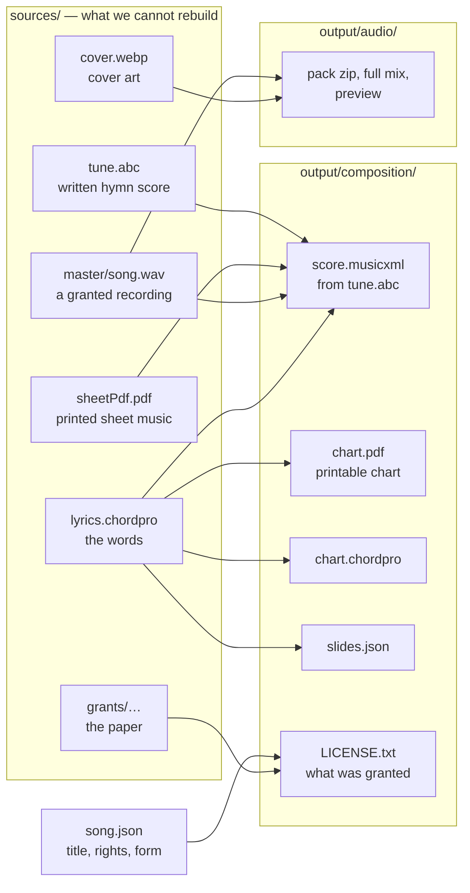

# WorshipCommons Content Library

The songs behind [worshipcommons.org](https://worshipcommons.org). Each song is a folder of files. Everything here is freely usable under the license on that song — see [LICENSE.md](LICENSE.md).

---

## The 30-second version

One file and two folders:

| Path | Meaning | Who may edit it |
|---|---|---|
| `song.json` | Identity, rights, form map. Nothing rebuilds it | A person, on purpose |
| `sources/` | Bytes this package cannot reproduce from its own other files | Acquired bytes never; files we authored, on purpose |
| `output/` | Anything `generate.mjs` or `pack/build.py` rebuilds on any machine | Nobody. Rebuild it |

**The test: delete the file — can a tool in this repo rebuild it byte-for-byte?**
Yes -> `output/`. No -> `sources/`. That is why the words, the covers and the lyric timings are
sources even though we produced some of them: nothing in here regenerates them.

**If a chart is wrong, fix the source (or the generator). Never patch the output.** `output/` is
gitignored in full, with no exceptions — that is only safe because nothing unrebuildable lives there.

`catalog.json` is the index of the library. It is generated from the folders and must match a fresh build.

---

## What’s in this repo

```
songs/<lang>/<slug>-<id>/      one package per song
  song.json                    identity, rights, form
  sources/                     manifest.json + every byte we cannot rebuild
    grants/                    the paper: signed grant, email, form receipt
    master/                    a granted recording, when we have one
    extra/                     granted but not processed (tabs, orchestra parts)
  output/
    composition/               charts, slides, score, slides.json, LICENSE.txt
    audio/                     pack zip + full mix + preview — only with a master grant
works/<slug>/                  translation families (work.json at the root)
writers/<slug>/                portraits and bios, shared across songs
licenses/                      full text of each song license
sources.json                   where content came from, and any attribution we owe
themes.json                    allowed theme tags
catalog.json                   generated index of the whole library
tools/                         Node scripts (no npm install); tools/pack/ is python
```

Example: [Amazing Grace](songs/en/amazing-grace-YxPfAFYWOaG/) lives at

```
songs/en/amazing-grace-YxPfAFYWOaG/
```

- `en` is the language folder (`English` -> `en`).
- `amazing-grace` is a cosmetic slug from the title. Changing the title does **not** rename the folder.
- `YxPfAFYWOaG` is the frozen song id (always the last 11 characters of the folder name; ids can start with `-` or `_`, so do not split on the dash).

**The license is not in the path.** It is mutable — a writer relicenses, a PD claim gets corrected —
and this path is the bucket key and the asset URL. The license lives in `song.json` and the catalog.

---

## How a song is built: sources -> output



A song with `song.json` + `sources/lyrics.chordpro` is complete and valid. We do not invent a
melody without a recording or a written score. A granted mix in `sources/master/` always
runs `python tools/pack/build.py`: a stems pack of the instruments that are in the mix
(vocal + guitar stays vocal + guitar), then a multi-instrument MIDI from the stems and
melody MusicXML with the ChordPro words underlaid. MIDI preserves detected performance
timing; notation uses the tracked beat grid. That generated score is a sketch until a
person promotes it to `sources/score.musicxml`. See the [audio-to-MIDI runbook](tools/pack/MIDI.md)
for reproduction commands, repeated-note handling, and validation against the stems.

### `sources/` — what we cannot rebuild

Two kinds of file live here, and `manifest.json` tells them apart. A file with no manifest row
does not exist as far as the tools are concerned.

| Kind | `original` | Rule |
|---|---|---|
| Acquired — a MIDI, an ABC file, a hymnal scan, a granted recording | `true` | Frozen. Keep the bytes as fetched; the sha256 must match forever. If it is wrong, add a new file and a new row |
| Ours — the words we typed, a cover we generated once, lyric timings | `false` | Editable on purpose; git history is the log. Re-run `writeManifest` so the sha stays true |

| File | What it is |
|---|---|
| `lyrics.chordpro` | The **words**. Always present. Nothing in this repo rebuilds them |
| `tune.abc` | Open Hymnal SATB score (often on the **work**, shared by translations) |
| `tune.mid` | Cyber Hymnal / HymnSite MIDI (pitch sketch, not a proofread score) |
| `score.musicxml` | The notes, when a person proofread them or someone gave them to us. Optional — `output/` holds the ABC conversion instead |
| `sheetPdf.pdf`, `*.ly` | Scanned or engraved sheet, plus LilyPond source when we have it |
| `cover.webp` | The package image. Generated once; kept, never regenerated |
| `timing.json` | Lyric timings for karaoke. Hymns: `tools/harvest/generate-lyric-timings.py` (ABC+MIDI). Writer recordings: `tools/harvest/align-vocal-timings.py` (MP3 vocal) |
| `master/<name>.wav` | A granted master recording. One per song. A YouTube id is a link, not a master |
| `grants/<date>-<who>.<ext>` | The grant itself — what a manifest row's `evidence` points at |
| `hymnary.json` | Harvested hymnal counts — used at catalog build, not copied into `song.json` |
| `video.json` | A YouTube id. A link, not our recording |
| `manifest.json` | One row per file in this folder, subfolders included |

Harvested facts stay here. Do not paste hymnal counts or YouTube ids into `song.json`.

**Grants.** A song has two independent rights layers: the composition (words, melody, chords —
**required**, no grant no song) and the master recording (optional — it unlocks multitracks).
`song.json` `rights.<layer>` says what license each layer carries; the manifest row for each
file says who granted it, when, how, and where the paper is:

```json
{
  "file": "master/song.wav",
  "layer": "recording",
  "license": "WC",
  "licenseVersion": "1.0",
  "submittedBy": "Jane Doe",
  "acquired": "2026-09-12",
  "obtainedVia": "upload-form",
  "evidence": "grants/2026-09-12-jane-doe.pdf",
  "sha256": "..."
}
```

`layer` is one of `text` `tune` `arrangement` `recording` `artwork` `extra` `grant`.
`obtainedVia` is one of `upload-form` `email` `harvest` (needs a `url`) `transcription`
`public-domain` `generated`. `validate.mjs` enforces all of it, and refuses a master recording
whose grant is not on file. The whole flow is [.notes/song-pipeline.md](../../agents/WC/song-pipeline.md).

### `song.json` — what a person asserted

Title, writer, year, key, themes, scripture, license, per-layer `rights`, `form` map. The only
file at the package root, because it is the only thing that is neither given to us nor generated.

- `rights` — text, tune, arrangement, recording and artwork each have their own license row. A hymn is not one blob. `"Amazing Grace"` words + tune can be public domain while a 2008 reharmonization is not.
- `form` — verse/chorus map and default singing order. Drafted by tools (`status: "draft"`) until a reviewer sets `"approved"`.
- `workRef` — which translation family this song belongs to, if any.

### `output/` — the machine wrote this

Rebuilt from scratch by `node tools/generate.mjs` and `python tools/pack/build.py`. Entirely
gitignored. Delete the folder and you lose nothing.

| File | From |
|---|---|
| `composition/score.musicxml` | `sources/tune.abc`, via the vendored abc2xml. A score in `sources/` wins and this one is removed |
| `composition/chart.chordpro` | Copy of the lyrics, until a score-driven chart generator exists |
| `composition/score.mid` | The score played out, via music21. Ours — `sources/tune.mid` is someone else's file |
| `composition/chart.pdf`, `stage.pdf` | Printed chart and stage chart, **original key only** — other keys are transposed on demand |
| `composition/slides.json` | Projection slides from the lyric sections |
| `composition/duration.json` | Sing time, from `sources/timing.json` or estimated |
| `composition/attribution.txt` | Pasteable credit line |
| `composition/sources.txt` | Human-readable provenance |
| `composition/LICENSE.txt` | What was granted, by whom, what a church may do. Travels inside every bundle |
| `composition/cover-thumb.webp` | Thumbnail of `sources/cover.webp` |
| `audio/<pack>.zip` + `-fullmix.m4a` + `-preview.m4a` | Multitracks bundle from the granted master — see [tools/pack/README.md](tools/pack/README.md) |

**One owner per kind of fact.** The words are either `sources/lyrics.chordpro` or
`output/composition/lyrics.chordpro`, never both — `validate` errors if two files claim the same
fact, because one of them is silently stale. Same for `score.musicxml`. The source always wins.

---

## `catalog.json`

```
node tools/build-catalog.mjs
```

Commit it in the **same commit** as the content that changed. Paths in the catalog are repo-relative (`songs/en/amazing-grace-YxPfAFYWOaG/…`) and the content bucket mirrors them, so a path change means a bucket re-sync and an asset re-seed.

---

## Changing curated content

1. Edit the package.
   - Facts a person is asserting → `song.json`
   - Lyrics / chords → `sources/lyrics.chordpro`
   - Harvested facts, granted files, the paper → `sources/`
   - Do not edit `output/`
2. Rebuild, reindex, check:

   ```
   node tools/generate.mjs songs/en/amazing-grace-YxPfAFYWOaG
   node tools/build-catalog.mjs
   node tools/validate.mjs
   ```

   `generate.mjs` also accepts a slug (`amazing-grace`), a language folder (`songs/en`), or no argument (whole library).
3. Commit the package **and** the regenerated `catalog.json` together. The commit message is the change note.

### Adding a new song

1. Create `songs/<lang>/<slug>/` with `song.json` and `sources/` (at least `lyrics.chordpro` and `manifest.json`). Leave `id` out of `song.json`.
2. Run `node tools/validate.mjs` — it will print the id to stamp.
3. Rename the folder to `<slug>-<id>` so the last 11 characters match. `validate` errors if they disagree.
4. Generate, build-catalog, validate, commit.

Required in `song.json` for a catalog song: `id`, `title`, `writer`, `language`, `license`, `timeSignature`, `rights`. Themes must be names from `themes.json`. The license must be an id in `licenses/licenses.json` (the six featured grants, or a custom writer grant).

---

## Translations (`works/`)

Translations of the same hymn are **separate songs** grouped by a work.

```
works/amazing-grace/
  work.json                 { slug, title, canonicalSongId }
  sources/tune.abc          shared tune
  sources/tune.mid
  sources/cover.webp        shared cover
```

Each language’s song points at it with `"workRef": "amazing-grace"` in `song.json`. A song inherits any file it does not override.

**The tune and the art are shared. The words are not.** A translation always has its own `sources/lyrics.chordpro`, and `timing.json` is always per song. The score is not shared either — each member rebuilds it into its own `output/` from the inherited `tune.abc`.

If a member file is byte-identical to the work’s, `validate` errors — delete the copy so it inherits.

**First translation of a song:** put `"parent": { "id": "<original id>", "title": "..." }` on the new song and run:

```
node tools/migrate-works.mjs
```

That creates (or adopts into) the work, moves shared files, and writes `workRef`. After that, do not keep a `parent` field; the catalog derives the family from the work.

---

## Tools

Plain Node ≥ 18, no `npm install`. Python 3 on PATH is needed for ABC → MusicXML (`generate.mjs` warns and skips that step otherwise). The converter is vendored at `tools/vendor/abc2xml.py`.

Run from the repo root. Run `validate` before every commit.

| Command | What it does |
|---|---|
| `node tools/validate.mjs` | Schema and consistency checks. Exit 1 on errors |
| `node tools/generate.mjs [folder]` | Rebuild `output/composition/` for one package or the whole library |
| `node tools/generate-scores.mjs [folder]` | Score step only: `output/composition/score.musicxml` from `sources/tune.abc` |
| `node tools/build-catalog.mjs` | Regenerate `catalog.json` from the folders |
| `node tools/find-duplicates.mjs` | Report the same hymn under variant titles (`--apply` links them) |
| `node tools/migrate-works.mjs` | Create/adopt a work when a song gains its first translation |
| `python tools/pack/build.py [folder]` | Multitracks bundle for every package with a granted master recording. Idempotent; see [tools/pack/README.md](tools/pack/README.md) |

One-shot migrations (safe to re-run; they no-op when already done):

| Command | What it did |
|---|---|
| `node tools/migrate-layout.mjs` | Dropped the license folder level and split each package into `song.json` / `sources/` / `output/` |

Importers that built this library live in `tools/harvest/`. They are not needed to consume or edit it. See [tools/harvest/README.md](tools/harvest/README.md).

---

## Licenses

One license per song, named in `song.json` — not in the path, because a license can change and the path is the bucket key. We do not host no-derivatives (ND) licenses: transposing, arranging, and translating are the point.

| `song.json` `license` | In short |
|---|---|
| `PD` | Public domain / CC0 |
| `WC` | WorshipCommons License — free for worship; commercial rights stay with the writer |
| `CC-BY` | Credit required |
| `CC-BY-SA` | Credit required; derivatives share alike |
| `CC-BY-NC` | Credit required; no commercial use |
| `CC-BY-NC-SA` | Both of the above |

Individual layers can differ from the song's headline license — `song.json` `rights.<layer>` is the detail. Full terms: [LICENSE.md](LICENSE.md) and `licenses/`. Per-song provenance is in `sources/manifest.json` and the generated `output/composition/sources.txt`.

---

## Languages

`song.json` `"language"` is the English name; the folder is the code.

| Language | Folder |
|---|---|
| English | `en` |
| Malayalam | `ml` |
| Spanish | `es` |
| French | `fr` |
| Hungarian | `hu` |
| German | `de` |
| Portuguese | `pt` |
| Russian | `ru` |
| Albanian | `sq` |
| Latin | `la` |
| Swedish | `sv` |
| Zulu | `zu` |

---

## Writers

`writers/<slug>/` holds a portrait and a short bio, shared by every song that sets `writerRef`. Portraits are Wikimedia-verified public domain / CC0. Bios are Wikipedia openings, CC BY-SA. See [writers/LICENSE.md](writers/LICENSE.md).
