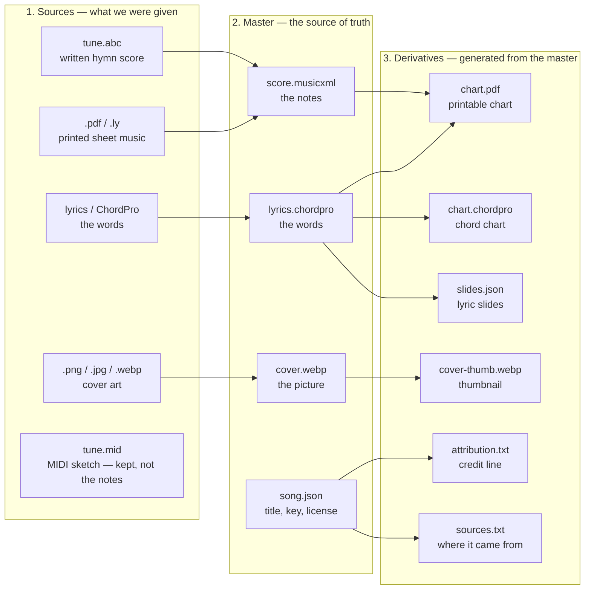

# WorshipCommons Content Library

The songs behind [worshipcommons.org](https://worshipcommons.org). Each song is a folder of files. Everything here is freely usable under the license on that song — see [LICENSE.md](LICENSE.md).

---

## The 30-second version

Every file in a song belongs in **exactly one** of three folders:

| Folder | Meaning | Who may edit it |
|---|---|---|
| `sources/` | What we got from somewhere else (a MIDI, an ABC file, a hymnal scan, a YouTube id) | Nobody. Ever. Keep the original bytes. |
| `masters/` | What a person approved as the truth (lyrics, metadata, a proofread score, cover art) | A person, on purpose. |
| `derivatives/` | What a machine built from the master (charts, slides, thumbs) | Nobody. Rebuild it. |

**If a chart is wrong, fix the master (or the generator). Never patch the derivative.**

`catalog.json` is the index of the library. It is generated from the folders and must match a fresh build.

---

## What’s in this repo

```
songs/<lang>/<license>/<slug>-<id>/   one package per song
  sources/                            originals; never edited
  masters/                            human-approved source of truth
  derivatives/                        generated; rebuildable
works/<slug>/                         translation families (same three folders)
writers/<slug>/                       portraits and bios, shared across songs
licenses/                             full text of each song license
sources.json                          where content came from, and any attribution we owe
themes.json                           allowed theme tags
catalog.json                          generated index of the whole library
tools/                                Node scripts (no npm install)
```

Example: [Amazing Grace](songs/en/public-domain/amazing-grace-YxPfAFYWOaG/) lives at

```
songs/en/public-domain/amazing-grace-YxPfAFYWOaG/
```

- `en` is the language folder (`English` → `en`).
- `public-domain` is the license section (`PD` → `public-domain`).
- `amazing-grace` is a cosmetic slug from the title. Changing the title does **not** rename the folder.
- `YxPfAFYWOaG` is the frozen song id (always the last 11 characters of the folder name; ids can start with `-` or `_`, so do not split on the dash).

---

## How a song is built: sources → master → derivatives

Three steps, always in this order:

1. **Sources** — the files we were given. We never change them.
2. **Master** — those files compiled into one approved original. This is the source of truth.
3. **Derivatives** — every chart, slide, and thumbnail is generated from that master. If a derivative is wrong, we fix the master and rebuild. We never edit a derivative by hand.

A song’s master can be a few files (notes, words, picture, title/license), but together they are **one** source of truth.



Hymnal counts and YouTube links stay in `sources/` as extras. They are not copied into the master. A MIDI file is stored as a source; it does not become the notes. The notes come from a written score (`tune.abc` or a PDF).

### `sources/` — we did not write this

Keep what we acquired, byte-for-byte. Record each file in `sources/manifest.json` (url, date, checksum, license basis). A file with no manifest row does not exist as far as the tools are concerned.

| File | What it is |
|---|---|
| `tune.abc` | Open Hymnal SATB score (often on the **work**, shared by translations) |
| `tune.mid` | Cyber Hymnal / HymnSite MIDI (pitch sketch, not a proofread score) |
| `sheetPdf.pdf`, `*.ly` | Scanned or engraved sheet, plus LilyPond source when we have it |
| `hymnary.json` | Harvested hymnal counts — used at catalog build, not copied into `song.json` |
| `video.json` | A YouTube id. A link, not our recording |
| `manifest.json` | One row per file in this folder |

Harvested facts stay here. Do not paste hymnal counts or YouTube ids into `masters/song.json`.

### `masters/` — a person signed off

Nothing lands here without a human. The generator may *draft* a candidate; a reviewer *promotes* it.

| File | What it is |
|---|---|
| `song.json` | What a person asserted: title, writer, year, key, themes, scripture, license, per-layer rights, form map |
| `lyrics.chordpro` | The **words**. Always present. Chords live here only when there is no proofread score |
| `score.musicxml` | The **notes**. Open Hymnal ABC converts here and is trusted. Optional. Absence is fine. |
| `cover.webp` | Approved cover |
| `art.<ext>` | Writer-supplied original art, if any |
| `recording/` | A human recording under a free license, if anyone contributed one |

A song with only `song.json` + `lyrics.chordpro` is a complete, valid song. We do not invent a melody to satisfy a format.

**One owner per kind of fact.** Words live in `lyrics.chordpro`. Notes live in `score.musicxml` once it exists. After that, the chart is generated from the score — do not keep a second hand-edited chord file that also claims to own the chords.

`song.json` also holds:

- `rights` — text, tune, arrangement, recording, and artwork each have their own license row. A hymn is not one blob. `"Amazing Grace"` words + tune can be public domain while a 2008 reharmonization is not.
- `form` — verse/chorus map and default singing order. Drafted by tools (`status: "draft"`) until a reviewer sets `"approved"`.
- `workRef` — which translation family this song belongs to, if any.

### `derivatives/` — the machine wrote this

Rebuilt from scratch by `node tools/generate.mjs`. Almost all of it is gitignored; `timing.json` is tracked until the score pipeline can rebuild it.

| File | From |
|---|---|
| `score.musicxml` | MIDI-derived notation only. ABC conversions go to `masters/score.musicxml`. |
| `chart.chordpro` | Copy of the lyrics master, until a score-driven chart generator exists |
| `chart.pdf` | Printed chart from the ChordPro stanzas |
| `slides.json` | Projection slides from the lyric sections |
| `duration.json` | Estimated sing time |
| `attribution.txt` | Pasteable credit line |
| `sources.txt` | Human-readable provenance |
| `cover-thumb.webp` | Thumbnail of `masters/cover.webp` |

A MIDI is **not** a master. A derived score from MIDI is labeled as such until a person proofreads it into `masters/`.

---

## `catalog.json`

```
node tools/build-catalog.mjs
```

Commit it in the **same commit** as the content that changed. Paths in the catalog are repo-relative (`songs/en/public-domain/amazing-grace-YxPfAFYWOaG/…`).

---

## Changing curated content

1. Edit the package.
   - Harvested facts → `sources/`
   - Facts a person is asserting → `masters/song.json`
   - Lyrics / chords → `masters/lyrics.chordpro`
   - Do not edit `derivatives/`
2. Rebuild, reindex, check:

   ```
   node tools/generate.mjs songs/en/public-domain/amazing-grace-YxPfAFYWOaG
   node tools/build-catalog.mjs
   node tools/validate.mjs
   ```

   `generate.mjs` also accepts a slug (`amazing-grace`), a language folder (`songs/en`), or no argument (whole library).
3. Commit the package **and** the regenerated `catalog.json` together. The commit message is the change note.

### Adding a new song

1. Create `songs/<lang>/<license>/<slug>/` with `sources/` and `masters/`. Leave `id` out of `song.json`.
2. Run `node tools/validate.mjs` — it will print the id to stamp.
3. Rename the folder to `<slug>-<id>` so the last 11 characters match. `validate` errors if they disagree.
4. Generate, build-catalog, validate, commit.

Required in `song.json` for a catalog song: `id`, `title`, `writer`, `language`, `license`, `timeSignature`, `rights`. Themes must be names from `themes.json`. The license must match the folder (`PD` → `public-domain`, `WC` → `wc-license`, and so on).

---

## Translations (`works/`)

Translations of the same hymn are **separate songs** grouped by a work.

```
works/amazing-grace/
  sources/tune.abc          shared tune
  sources/tune.mid
  masters/work.json         { slug, title, canonicalSongId }
  masters/cover.webp        shared cover
```

Each language’s song points at it with `"workRef": "amazing-grace"` in `song.json`. A song inherits any file it does not override.

**The score (and shared tune/art) is shared. The words are not.** A translation always has its own `masters/lyrics.chordpro`. `timing.json` is always per song.

If a member file is byte-identical to the work’s, `validate` errors — delete the copy so it inherits.

**First translation of a song:** put `"parent": { "id": "<original id>", "title": "..." }` on the new song and run:

```
node tools/migrate-works.mjs
```

That creates (or adopts into) the work, moves shared files, and writes `workRef`. After that, do not keep a `parent` field; the catalog derives the family from the work.

---

## Tools

Plain Node ≥ 18, no `npm install`. Python 3 on PATH is needed for ABC → MusicXML (`generate.mjs` warns and skips that step otherwise). The converter is vendored at `tools/vendor/abc2xml.py`.

Run from the repo root. Run `validate` before every commit.

| Command | What it does |
|---|---|
| `node tools/validate.mjs` | Schema and consistency checks. Exit 1 on errors |
| `node tools/generate.mjs [folder]` | Rebuild `derivatives/` for one package or the whole library |
| `node tools/generate-scores.mjs [folder]` | Score step only: `masters/score.musicxml` from `sources/tune.abc` |
| `node tools/build-catalog.mjs` | Regenerate `catalog.json` from the folders |
| `node tools/find-duplicates.mjs` | Report the same hymn under variant titles (`--apply` links them) |
| `node tools/migrate-works.mjs` | Create/adopt a work when a song gains its first translation |

One-shot migrations (safe to re-run; they no-op when already done):

| Command | What it did |
|---|---|
| `node tools/rename-packages.mjs` | Folder names → `<slug>-<id>` |
| `node tools/migrate-packages.mjs` | Split flat folders into `sources/` / `masters/` / `derivatives/` |
| `node tools/align-packages.mjs` | Hymnal JSON, covers, form-map drafts, artwork rows, PD review flags |

Importers that built this library live in `tools/harvest/`. They are not needed to consume or edit it. See [tools/harvest/README.md](tools/harvest/README.md).

---

## Licenses

Songs are split by license at the folder level. One license per song. We do not host no-derivatives (ND) licenses: transposing, arranging, and translating are the point.

| Folder | `song.json` `license` | In short |
|---|---|---|
| `songs/*/public-domain/` | `PD` | Public domain / CC0 |
| `songs/*/wc-license/` | `WC` | WorshipCommons License — free for worship; commercial rights stay with the writer |
| `songs/*/cc-by/` | `CC-BY` | Credit required |
| `songs/*/cc-by-sa/` | `CC-BY-SA` | Credit required; derivatives share alike |
| `songs/*/cc-by-nc/` | `CC-BY-NC` | Credit required; no commercial use |
| `songs/*/cc-by-nc-sa/` | `CC-BY-NC-SA` | Both of the above |

Full terms: [LICENSE.md](LICENSE.md) and `licenses/`. Per-song provenance is in `sources/manifest.json` and the generated `derivatives/sources.txt`.

---

## Languages

`song.json` `"language"` is the English name; the folder is the code.

| Language | Folder |
|---|---|
| English | `en` |
| Malayalam | `ml` |
| Spanish | `es` |
| French | `fr` |
| Hungarian | `hu` |
| German | `de` |
| Portuguese | `pt` |
| Russian | `ru` |
| Albanian | `sq` |
| Latin | `la` |
| Swedish | `sv` |
| Zulu | `zu` |

---

## Writers

`writers/<slug>/` holds a portrait and a short bio, shared by every song that sets `writerRef`. Portraits are Wikimedia-verified public domain / CC0. Bios are Wikipedia openings, CC BY-SA. See [writers/LICENSE.md](writers/LICENSE.md).
